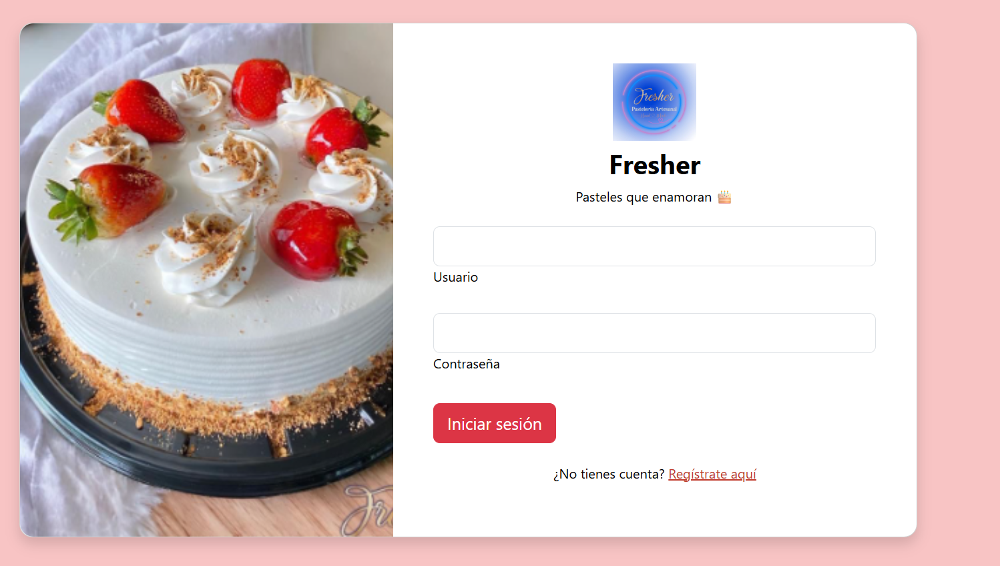
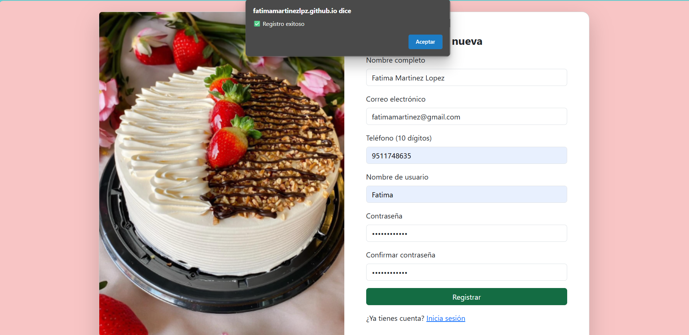
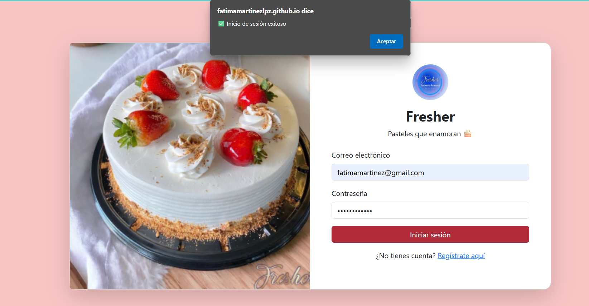
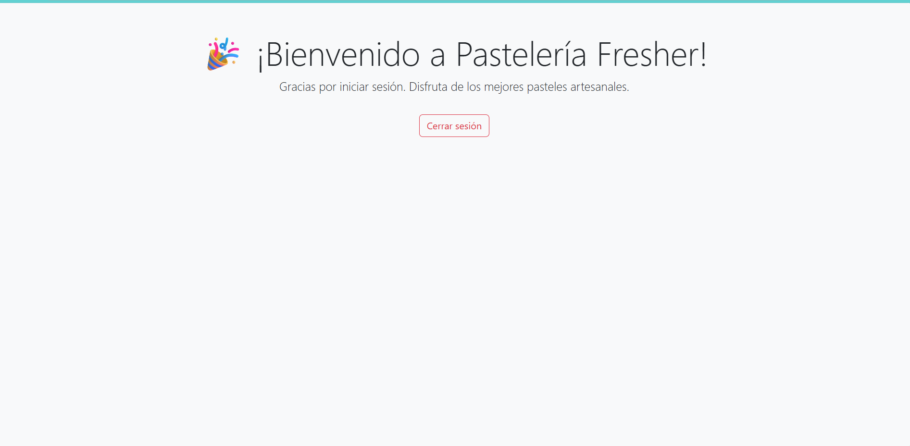

# login

**Sistema de Registro e Inicio de Sesión**

**Estudiante:**
- Fatima Martinez Lopez

---
## Descripción
**Nombre del trabajo:**  
Sistema de Registro e Inicio de Sesión para la Pastelería Fresher

**Breve descripción:**  
Este proyecto web permite a los usuarios registrarse e iniciar sesión en un sistema para la pastelería "Fresher". Está diseñado con HTML, CSS (Bootstrap), y JavaScript, almacenando los datos localmente mediante `localStorage`.

---

##  Documentación

###  Estructura del Proyecto

El proyecto está compuesto por los siguientes archivos:

- **`login.html`** – Página de inicio de sesión.
- **`registro.html`** – Página de registro de nuevos usuarios.
- **`bienvenida.html`** – Página que se muestra al iniciar sesión exitosamente.
- **`login.js`** – Lógica de validación del inicio de sesión.
- **`registro.js`** – Validación y almacenamiento de nuevos usuarios.
- **`css/login.css`** – Estilo personalizado para los formularios.
- **`/imagen/`** – Carpeta con imágenes utilizadas (pasteles y logo).
- **`README.md`** – Este archivo de documentación.

---

###  Principales Funcionalidades y Métodos

#### En `registro.js`
- `RegistroUtils`: Objeto que agrupa funciones de validación:
  - `campoNoVacio(valor)`
  - `formatearNombre(nombre)`
  - `validarCorreo(correo)`
  - `validarTelefono(telefono)`
  - `validarContrasena(password)`
  - `confirmarContrasena(pass1, pass2)`
- Evento `submit` en el formulario que:
  - Valida los campos.
  - Revisa si el usuario ya está registrado.
  - Guarda los datos en `localStorage`.

#### En `login.js`
- Validación contra los datos en `localStorage`.
- Autenticación por **correo electrónico y contraseña**.
- Redirección a `bienvenida.html` si los datos son correctos.

---

###  Estilos (login.css)

- Fuentes suaves y modernas.
- Diseño responsive con Bootstrap 5.
- Tarjetas con bordes redondeados.
- Logo circular sobre el formulario de login.
- Imagen decorativa en el lado izquierdo del formulario.
- Colores institucionales de Fresher (`#81294f`, `#78182d`, fondo rosado).

---

##  Capturas de Pantalla

###  Login con logo circular y mensaje

###  Registro de usuario exitoso

###  Acceso correcto

###  Mensaje de bienvenida

---

##  Tecnologías utilizadas

- HTML5
- CSS3 (con Bootstrap 5.3.3)
- JavaScript Vanilla
- `localStorage` para almacenamiento

- 
## Demostración en Línea - GitHub Pages

Puedes probar el funcionamiento de la librería directamente aquí:

[Ver demostración en línea](https://fatimamartinezlpz.github.io/Login/)

     
